<b>Also on the bench</b>

 

| Project | What it is | Built with |
|---|---|---|
| [**Brownie Bliss**](https://github.com/adithyan-css/Brownie-Bliss) ⭐ 43 | Full-stack bakery store: OTP checkout, WhatsApp orders, admin panel with receipts · [live](https://brownie-bliss-mu.vercel.app/) | Node · Express · MongoDB |
| [**Bug Copilot**](https://github.com/adithyan-css/bug-copilot) | Real-time bug triage that re-ranks severity as tickets stream in | Pathway · Python · MiniLM |
| [**Portfolio**](https://github.com/adithyan-css/portfolio) | Scroll-driven 3D particle field, a playable driving game and a hidden terminal | React · three.js · TypeScript |
| [**Ayush Healthcare**](https://github.com/adithyan-css/Ayush_healthcare) | Healthcare app with a Python backend | Flutter · Python |

