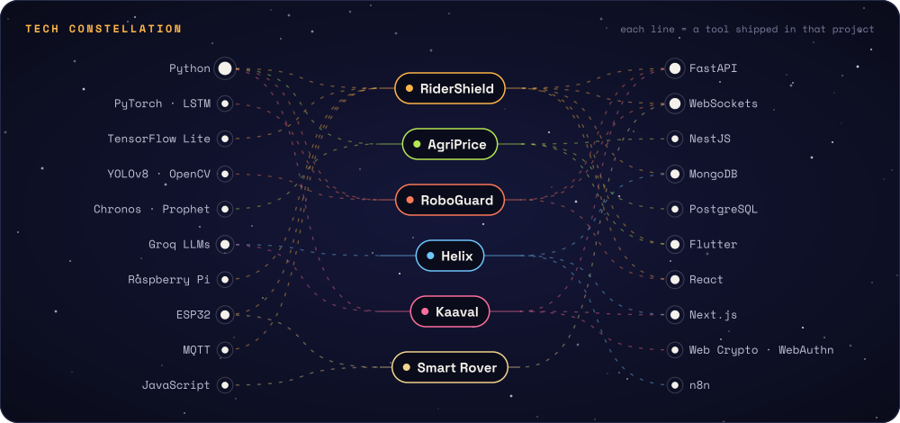

  <a href="https://adithyan-psi.vercel.app"><b>portfolio</b></a> &nbsp;✦&nbsp;
  <a href="https://linkedin.com/in/adithyan-c-s-s"><b>linkedin</b></a> &nbsp;✦&nbsp;
  <a href="https://github.com/adithyan-css?tab=repositories"><b>all repositories</b></a>

 

  
  
  
  
  
  

tap a card to open the project

 

 

<b>more from the hangar</b>

 

- [**Brownie Bliss**](https://github.com/adithyan-css/Brownie-Bliss) ⭐ 43 — full-stack bakery store with OTP checkout and WhatsApp orders · [live](https://brownie-bliss-mu.vercel.app/)
- [**Bug Copilot**](https://github.com/adithyan-css/bug-copilot) — real-time bug triage on Pathway's streaming engine
- [**Portfolio**](https://github.com/adithyan-css/portfolio) — scroll-driven 3D particle field, a playable driving game and a hidden terminal
- [**Ayush Healthcare**](https://github.com/adithyan-css/Ayush_healthcare) — Flutter healthcare app with a Python backend

