 

 

## ⬢ About

## ⬢ Selected Work

<table>
<tr>
<td width="50%" valign="top">

### [RiderShield AI](https://github.com/adithyan-css/RIDERSHIELD_AI)

On-device collision detection for riders. An INT8 MobileNetV2 runs on a Raspberry Pi and an ESP32 → MQTT → FastAPI pipeline pushes hazards to a Flutter app and an ops dashboard.

`TFLite` `Python` `ESP32` `MQTT` `FastAPI` `Flutter`

**15 FPS on the edge · <100 ms latency budget**

</td>
<td width="50%" valign="top">

### [AgriPrice AI](https://github.com/adithyan-css/Agri_app)

Crop price intelligence for Indian farmers: live mandi prices, 7-day forecasts and sell-or-wait calls from an ensemble that reports its own uncertainty.

`Chronos` `Prophet` `NestJS` `PostgreSQL` `Flutter`

**3-model ensemble · confidence bands · 92 markets**

</td>
</tr>
<tr>
<td width="50%" valign="top">

### [RoboGuard](https://github.com/adithyan-css/RoboGuard)

Robot mission control. An LSTM predicts motor faults from telemetry, YOLOv8 watches safety zones, and a React dashboard streams it all over WebSockets.

`PyTorch` `YOLOv8` `FastAPI` `WebSockets` `React`

**Faults flagged 10–30 steps early · 10 Hz telemetry**

</td>
<td width="50%" valign="top">

### [Kaaval](https://github.com/adithyan-css/Kaaval)

Defence against session hijacking. Each request is signed by a non-exportable browser key and re-verified at the gateway, so a stolen cookie on its own is refused.

`Web Crypto` `WebAuthn` `FastAPI` `Next.js` `SSE`

**7 checks per request · 162 tests passing**

</td>
</tr>
<tr>
<td width="50%" valign="top">

### [Helix](https://github.com/adithyan-css/Helix)

Self-healing layer for AI-built software: it red-teams itself, patches what it finds and stores fixes as immune memory so they can't regress.

`TypeScript` `MongoDB Atlas` `Groq` `n8n`

**1536-d immune memory · sovereign LLM fallback**

</td>
<td width="50%" valign="top">

### [Smart Rover](https://smart-rover-opal.vercel.app)

Control station for an ESP32 rover: live control, telemetry and safety monitoring, served straight from the rover's own access point.

`JavaScript` `WebSocket` `ESP32`

**Zero frameworks · zero CDNs · [live demo](https://smart-rover-opal.vercel.app)**

</td>
</tr>
</table>

## ⬢ Console

## ⬢ Stack

 

 

 

 

## ⬢ Activity

<picture>
  <source media="(prefers-color-scheme: dark)" srcset="https://raw.githubusercontent.com/adithyan-css/adithyan-css/output/snake-dark.svg" />
  <source media="(prefers-color-scheme: light)" srcset="https://raw.githubusercontent.com/adithyan-css/adithyan-css/output/snake-light.svg" />
  
</picture>

